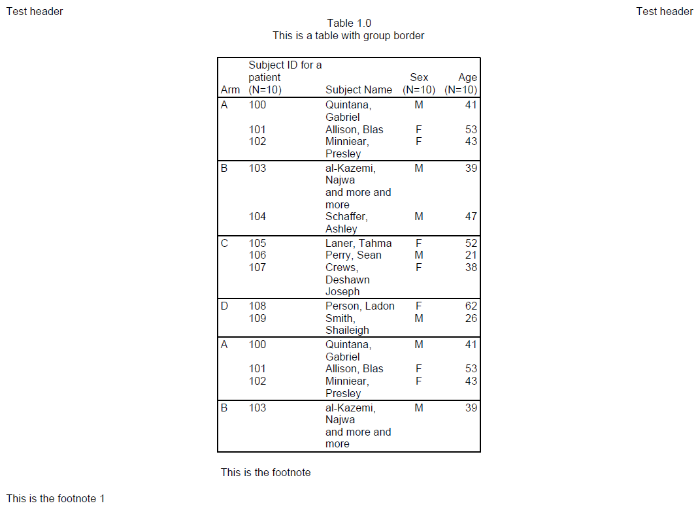
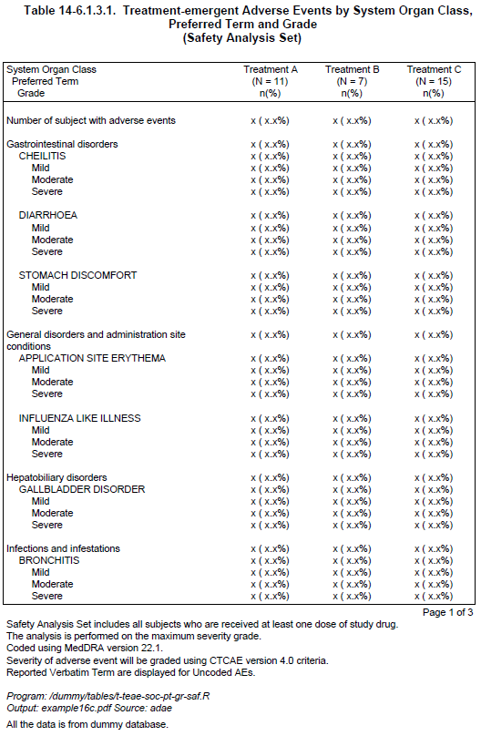
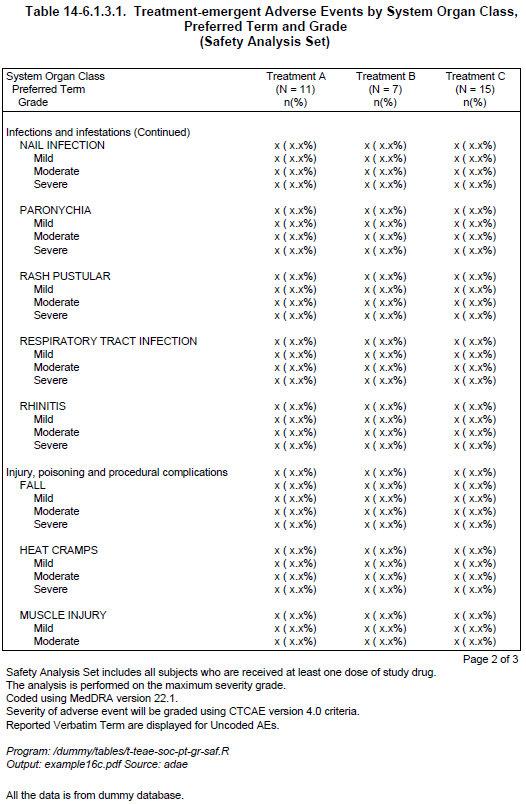
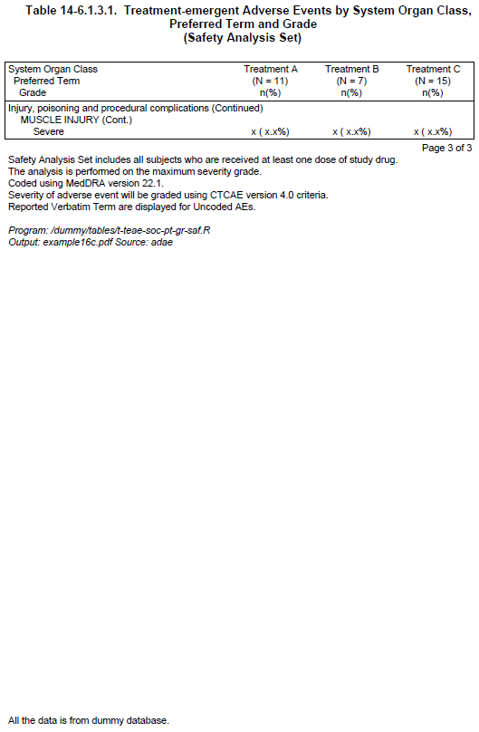
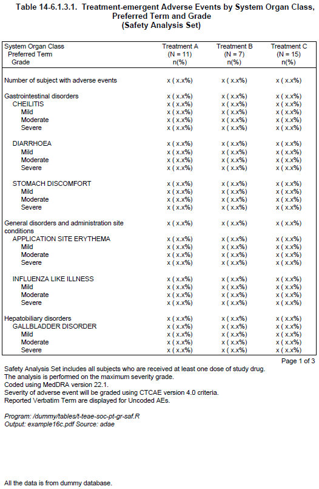
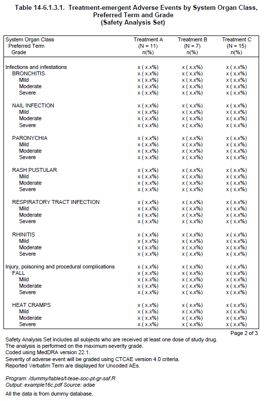
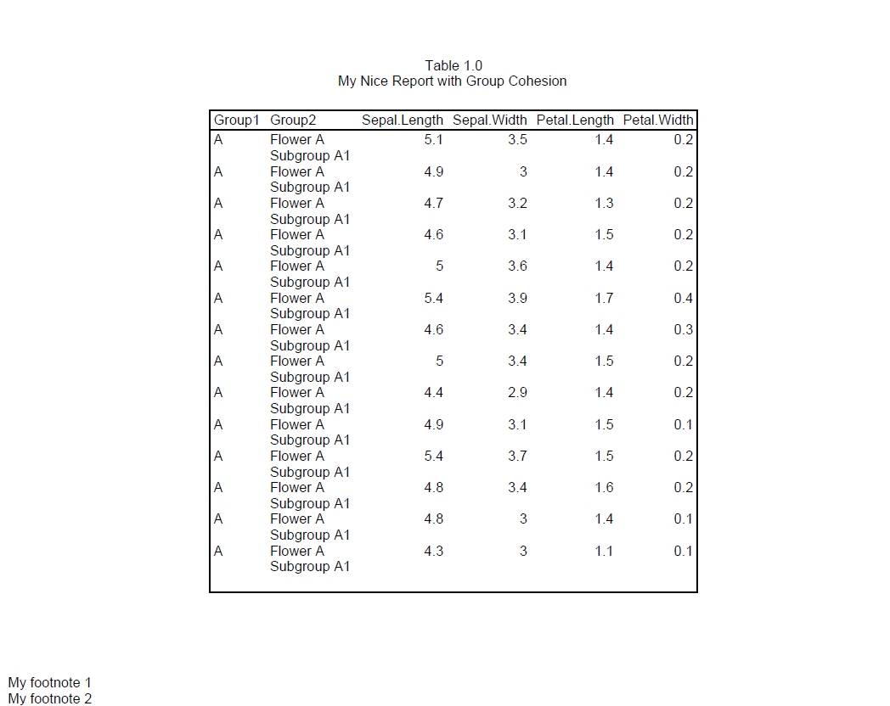
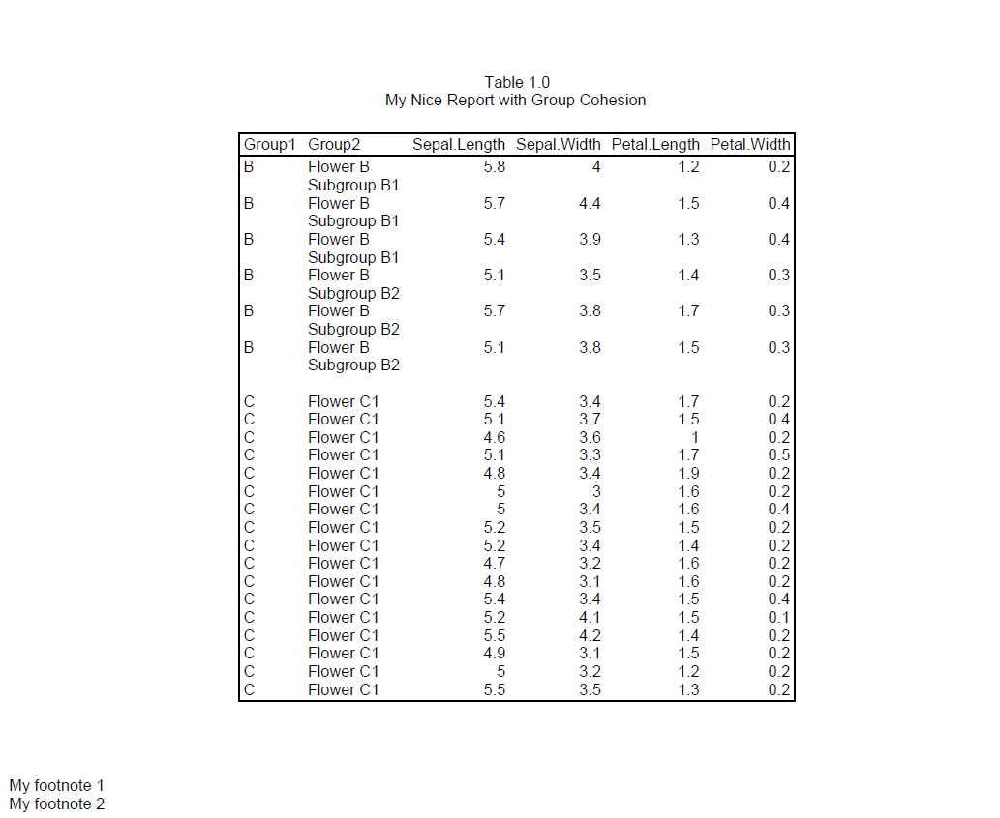
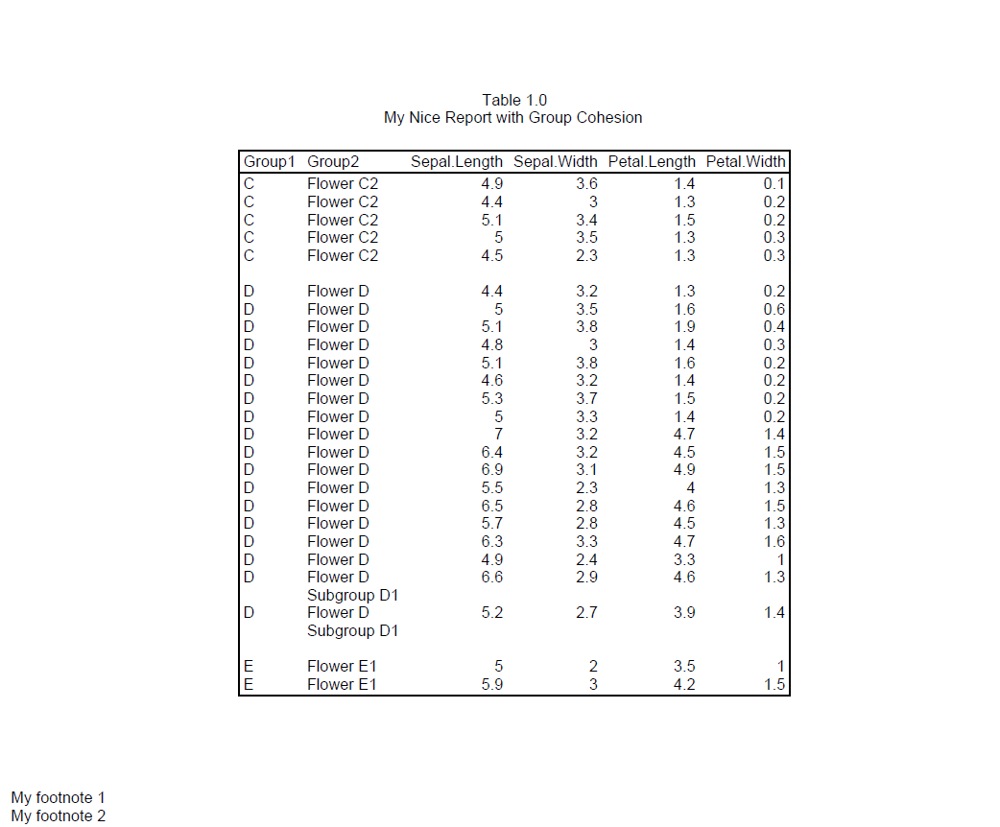

```{r setup, include = FALSE}
knitr::opts_chunk$set(
  collapse = TRUE,
  comment = "#>"
)
```

## Group Border

The **reporter** package can draw bottom lines to separate different groups by
setting `group_border = TRUE` in `define()`.

Here is an example:
```{r eval=FALSE, echo=TRUE} 
library(reporter)

# Create temp file name
tmp <- file.path(tempdir(), "example16a.pdf")

# Create data
arm <- c(rep("A", 3), rep("B", 2), rep("C", 3), rep("D", 2))
subjid <- 100:109
name <- c("Quintana, Gabriel", "Allison, Blas", "Minniear, Presley",
          "al-Kazemi, Najwa \nand more and more", "Schaffer, Ashley", "Laner, Tahma",
          "Perry, Sean", "Crews, Deshawn Joseph", "Person, Ladon",
          "Smith, Shaileigh")
sex <- c("M", "F", "F", "M", "M", "F", "M", "F", "F", "M")
age <- c(41, 53, 43, 39, 47, 52, 21, 38, 62, 26)

df <- data.frame(arm, subjid, name, sex, age, stringsAsFactors = FALSE)
df <- rbind(df, df, df, df)

# Output with group_border
tbl1 <- create_table(df, first_row_blank = FALSE, borders = "outside") %>%
  define(subjid, label = "Subject ID for a patient", n = 10, align = "left",
         width = 1) %>%
  define(name, label = "Subject Name", width = 1) %>%
  define(sex, label = "Sex", n = 10, align = "center") %>%
  define(age, label = "Age", n = 10) %>%
  define(arm, label = "Arm",
         dedupe = TRUE,
         group_border = TRUE) %>%
  footnotes("This is the footnote")


rpt <- create_report(tmp, output_type = "pdf", font = "Arial",
                     font_size = 10) %>%
  titles(c("Table 1.0", "This is a table with group border"), align = "center") %>%
  add_content(tbl1) %>%
  footnotes(c("This is the footnote 1")) %>%
  page_header(left = "Test header", right = "Test header") %>%
  set_margins(top = 1, bottom = 1)


res <- write_report(rpt)
```


## Break Label

For the outputs with hierarchy levels such as AE tables. Taking SOC as an example,
when SOC continues onto the next page, we might want to display the SOC again 
with suffix wording such as *"Continued"*. With `break_label = "Continued"` in 
`define()`, the **reporter** package will automatically generate the repeated SOC
with "Continued" at the top of next page.

Here is an example:

```{r eval=FALSE, echo=TRUE} 
library(reporter)

fp <- file.path(tempdir(), "example16b.pdf")

# Prepare data
adae <- data.frame(
  total = rep("Number of subject with adverse events", 66),
  AESOC = c(NA, 
            rep("Gastrointestinal disorders", 13),
            rep("General disorders and administration site conditions", 9),
            rep("Hepatobiliary disorders", 5),
            rep("Infections and infestations", 25),
            rep("Injury, poisoning and procedural complications", 13)),
  AEDECOD = c(NA,
              NA, rep("CHEILITIS", 4), rep("DIARRHOEA", 4), rep("STOMACH DISCOMFORT", 4),
              NA, rep("APPLICATION SITE ERYTHEMA", 4), rep("INFLUENZA LIKE ILLNESS", 4),
              NA, rep("GALLBLADDER DISORDER", 4),
              NA, rep("BRONCHITIS", 4), rep("NAIL INFECTION", 4), rep("PARONYCHIA", 4),
                  rep("RASH PUSTULAR", 4), rep("RESPIRATORY TRACT INFECTION", 4),
                  rep("RHINITIS", 4),
              NA, rep("FALL", 4), rep("HEAT CRAMPS", 4), rep("MUSCLE INJURY", 4)
              )
)

adae$aedecod_seq <- rep(NA, nrow(adae))
non_na_idx <- !is.na(adae$AEDECOD)
adae$aedecod_seq[non_na_idx] <- ave(adae$AEDECOD[non_na_idx], adae$AEDECOD[non_na_idx], FUN = seq_along)

adae$AESEV <- adae$aedecod_seq
adae$AESEV[adae$AESEV == "1"] <- NA
adae$AESEV[adae$AESEV == "2"] <- "Mild"
adae$AESEV[adae$AESEV == "3"] <- "Moderate"
adae$AESEV[adae$AESEV == "4"] <- "Severe"

adae$trt1 <- "x ( x.x%)"
adae$trt2 <- "x ( x.x%)"
adae$trt3 <- "x ( x.x%)"

adae$aedecod_id <- rep(NA, nrow(adae))
adae$aedecod_id[non_na_idx] <- ave(adae$AEDECOD[non_na_idx], adae$AESOC[non_na_idx],
                                   FUN = function(x){as.numeric(factor(x, levels = unique(x)))})

adae$blank_grp <- paste(adae$total, 
                        adae$AESOC, 
                        ifelse(adae$aedecod_id == 1,NA,adae$AEDECOD), 
                        sep = "|")

adae <- adae[, setdiff(names(adae), c("aedecod_seq", "aedecod_id"))]

# Output
custom_n_format <- function(x){
      return(paste0("\n(N = ",x,")\nn(%)"))
    }
    
current_date <- gsub(" ","",toupper(format(Sys.Date(),"%d %b %Y")))
current_time <- substr(Sys.time(),12,19)
output_name <- "example16c.pdf"
program_path <- "/dummy/tables/t-teae-soc-pt-gr-saf.R"
last_footnote <- paste0("Output: ",output_name," Source: adae")

total_width <- 6
trt_width <- 1.04
item_width <- total_width - (trt_width*3)

tbl <- create_table(adae, 
                    borders = "outside",
                    n_format = custom_n_format) %>%
  
  # ----- Column setting -----#
  column_defaults(from = trt1, to = trt3, align = "center", width = trt_width) %>%
  define(blank_grp, blank_before = T, visible = FALSE) %>%
  stub(vars = c("total", "AESOC", "AEDECOD", "AESEV"), 
       label = "System Organ Class\n  Preferred Term\n    Grade", 
       width = item_width) %>%
  define(AESOC, break_label = "(Continued)") %>%
  define(AEDECOD, indent = 0.16, break_label = "(Cont.)") %>%
  define(AESEV, indent = 0.32) %>%
  define(trt1, label = "Treatment A", n=11) %>%
  define(trt2, label = "Treatment B", n=7) %>%
  define(trt3, label = "Treatment C", n=15) %>%

  # ----- Footnote setting -----#
  footnotes("Page [pg] of [tpg]", align = "right", blank_row = "none", valign = "top") %>%
  footnotes("Safety Analysis Set includes all subjects who are received at least one dose of study drug.",
            align = "left", blank_row = "none", valign = "top") %>%
  footnotes("The analysis is performed on the maximum severity grade.",
            align = "left", blank_row = "none", valign = "top") %>%
  footnotes("Coded using MedDRA version 22.1.",
            align = "left", blank_row = "none", valign = "top") %>%
  footnotes("Severity of adverse event will be graded using CTCAE version 4.0 criteria.",
            align = "left", blank_row = "none", valign = "top") %>%
  footnotes("Reported Verbatim Term are displayed for Uncoded AEs.",
            align = "left", blank_row = "none", valign = "top") %>%
  footnotes(paste0("Program: ", program_path), italics = TRUE) %>%
  footnotes(last_footnote, blank_row = "none", italics = TRUE ) 

sty <- create_style(font_name = "Arial",
                    font_size = 9)

rpt <- create_report(fp, 
                     orientation = "portrait", 
                     output_type = "PDF")  %>%
  add_style(style = sty) %>%
  set_margins(top = 1, bottom = 0.75, right = 1, left = 1.5) %>%
  add_content(tbl) %>%
  
  # ----- Title setting -----#
  titles("Table 14-6.1.3.1.  Treatment-emergent Adverse Events by System Organ Class,",
         "Preferred Term and Grade",
         "(Safety Analysis Set)",
         bold = T,
         font_size = 11) %>%
  footnotes("All the data is from dummy database.")

# Write the report
res <- write_report(rpt)
```

Page 1:



<br>
Page 2:



<br>
SOC *"Infections and infestations"* continues onto the next page, so it is repeated 
at the top of page 2 with suffix *"(Continued)"*.

<br>
Page 3:<br>
<br>
Both SOC *"Injury, poisoning and procedural complications"* and preferred term
*"MUSCLE INJURY"* continue onto page 3, so they're repeated at the top with different
suffix words.

<br>
<br>


## Group Cohesion

Continuing from the previous example. If you want to avoid splitting the same 
group across multiple pages. You can use `group_cohesion = TRUE` in `define()` 
for AESOC and AEDECOD such like:<br> 
```{r eval=FALSE, echo=TRUE} 
define(AESOC, break_label = "(Continued)", group_cohesion = TRUE)
define(AEDECOD, indent = 0.16, break_label = "(Cont.)" , group_cohesion = TRUE)
```
Then the result will be:

Page 1:



<br>
Page 2:



<br>
We can see that the SOC *"Infections and infestations"* is not split because the
entire group is moved to page 2. That's how `group_cohesion` works to avoid 
splitting the same group across multiple pages. 

<br>
Let's see another example to learn more about `group_cohesion`:

```{r eval=FALSE, echo=TRUE} 
library(reporter)

fp <- file.path(tempdir(), "example16b.pdf")

dat <- iris[1:91,]

dat$group_1 <- c(
  rep("A", 14),
  rep("B", 6),
  rep("C", 22),
  rep("D", 18),
  rep("E", 31)
)

dat$group_2 <- c(
  rep("Flower A\nSubgroup A1", 14),
  rep("Flower B\nSubgroup B1", 3),
  rep("Flower B\nSubgroup B2", 3),
  c(rep("Flower C1", 17)),
  c(rep("Flower C2", 5)),
  c(rep("Flower D", 16), rep("Flower D\nSubgroup D1", 2)),
  c(rep("Flower E1", 2)),
  c(rep("Flower E2", 29))
)

dat <- dat[, c("group_1", "group_2", "Sepal.Length", 
               "Sepal.Width", "Petal.Length","Petal.Width")]

tbl <- create_table(dat, borders = "outside") %>%
  define(group_1, group_cohesion = TRUE, label = "Group 1", blank_after = T) %>%
  define(group_2, group_cohesion = TRUE, label = "Group 2")

rpt <- create_report(fp, output_type = "pdf", font = "Arial",
                     font_size = 10, orientation = "landscape") %>%
  titles("Table 1.0", "My Nice Report with Group Cohesion") %>%
  set_margins(top = 1, bottom = 1) %>%
  add_content(tbl) %>%
  footnotes("My footnote 1", "My footnote 2", borders = "none",
            blank_row = "none")

res <- write_report(rpt)
```

Page 1:


<br>
<br>
Page 2:


<br>
<br>
<br>
We can see that there is still space in the end of page 1, but it's not enough
for the entire group B. To keep group B in the same page, it is moved to the
page 2.

<br>
<br>
Page 3:


<br>
<br>
<br>
After group B, the remaining space is not enough for entire group C, and we cannot
move the entire group C to page 3 or the remaining space would be too much in page 2.
As a result, group C will be split from page 2 to page 3. However, because we set
`group_cohesion = TRUE` for both Group1 and Group2, when Group1 is split,
**reporter** will still keep Group2 on the same page as much as possible. Therefore, we
can see that the entire "Flower C2" is moved to page 3 because the remaining space
after "Flower C1" is not enough for "Flower C2".

#### Logic of Group Cohesion
The logic of group cohesion is very simple. If a group is to split, the entire
group will be moved to next page only if occupies at least 80% of the current page.
Accordingly, Group B moves to the next page because Group A occupies at least 80% 
of the page. Similarly, Group C2 moves to the next page because the combined data 
from Group B and Group C1 reaches the 80% threshold.
When `group_cohesion = TRUE`, the default strength of group cohesion is 0.2, 
which means the required proportion is `1 - 0.2 = 0.8`. Users can change the 
required proportion by assigning more strength such as `group_cohesion = 0.6`, 
which means the requirement of proportion is 0.4. Once the previous group has reached 
40% of page, the next group can be moved to next page if the remaining space is not enough.
That's say, the more strength of group cohesion, the lower the required proportion,
and the less likely the group is to split.
